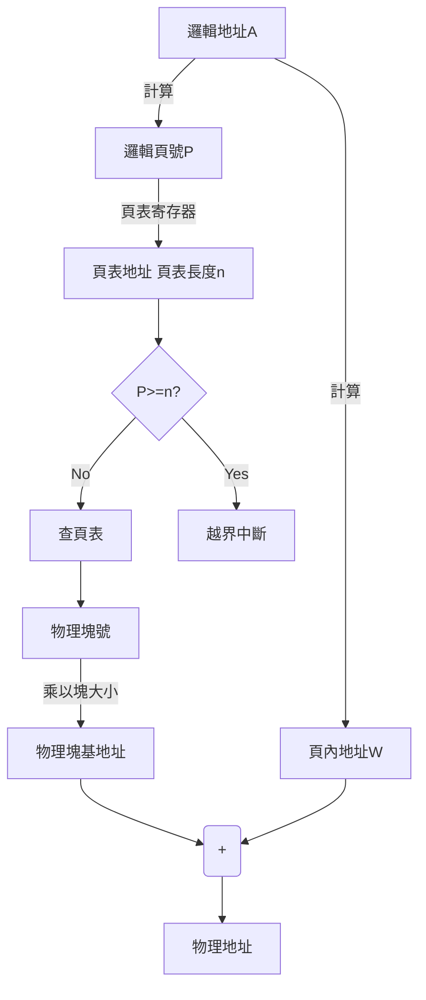

### **操作系統3-內存管理(分區存儲和頁式存儲)**

#### 2. 分區存儲管理方式

分區管理的基本思想是：**將內存空間氛圍一個或若干個連續的區域，稱為分區。每個分區可以存放一個獨立的用戶程序。分區的特點是一個程序可以連續地加載內存。**

分區可以分為：單一分區、固定分區、可變分區和重定位分區。

2.1 **單道程序的連續分配**

單道程序的連續分配方式將內存分為系統區和用戶區，只能用於單用戶、單任務的操作系統。

1. 系統區

   系統區僅供操作系統使用，一般駐留在內存的低地址區，其中包括中斷向量。中斷向量是操作系統的**核心功能模塊加載內存的起始地址**。

2. 用戶區

   操作系統所佔區域以外的全部內存空間，用戶區和系統區之間設立了嚴格的內存保護機制，防止用戶區的地址越界。

2.2 **固定分區分配方式**

系統在啟動時就劃分好多個分區，明確了分區的數量、大小和起始地址。這樣允許多道作業並發執行。但這樣也會使得部分分區的程序無法完全利用所有分區空間，也會導致部分程序因為佔用內存過大而無法裝入程序。因此會造成內存的浪費。

2.3 **動態分區分配**

動態分區根據進程的實際需要動態地分割內存。當進程運行完畢並釋放了其所佔用的空間時，如果這塊空間有相鄰的空閒的內存空間，則它們被合併為更大的空閒的內存空間。

動態分區需要解決的問題有：分區分配的數據結構、分區的分配算法、分區的分配與回收操作。

1. 數據結構

   常用的數據結構有空閒分區表和空閒分區鏈。

   1. 空閒分區表結構為:

      1. 1. 空閒分區說明表

      | 序號 | 分區大小(KB) | 分區地址(K) | 狀態 |
      | ---- | ------------ | ----------- | ---- |
      | 1    | 64           | 44          | 可用 |
      | 2    | 24           | 132         | 可用 |
      | 3    | 30           | 210         | 可用 |

   2. 空閒分區鏈

      每個分區的起始部分設置一個用於控制分區分配的信息，以及用於鏈接各分區的前向指針，形成一個鏈錶。

2. 分區分配算法

   新作業進入內存時，按照分配算法將空閒分區分配給作業。主要有以下四種分配算法。

   1. 首次符合法(First Fit)。每次分配空閒區時，總是從鏈首開始查詢，直到找到一個符合要求的空閒塊。
   2. 循環首次符合法(Next Fit)。在查詢內存空間時，不再從鏈首開始查，而是從上次分配內存的下一個空閒內存空間開始查詢。如果查到最後一個空間都不能滿足要求，指針應該又返回鏈首開始查詢，因為可能已經有其他作業釋放了足夠的內存空間。
   3. 最佳符合法(Best Fit)。要求所有空閒空間按照大小排序，請求內存的指針從最小的內存塊開始查，直到找到第一個符合請求空間大小的內存塊。

3. 分區分配和回收

   1. 分配內存。設所請求分區的大小為u.size，分區表中內存的大小為m.size，若$m.size - u.size \leq size$，size是事先規定好的不再分割內存大小，如果空閒分區在被內存請求切割的大小小於這個size，則分區不再切割，將整個分區都分配給請求。否則從分區分割出一個和請求內存大小一致的內存，其餘內存仍留在空閒分區表或空閒分區鏈中。

   2. 回收內存。

      回收內存的主要工作是首先檢查是否有相鄰分區，有則合併使之成為一個連續的空閒區，避免形成許多離散的小分區。然後還要修改分區的有關控制信息。

2.4 **可重定位分區**

1. 緊湊

   在連續分配方式中，必須把一個程序裝入連續的內存空間中，如果系統中存在若干個離散的小分區，每個分區都不能使程序裝入其中。但是這些分區的大小之和大於程序的請求內存。這時可以通過重定位的方式將分隔這些分區的作業移動到一起，使得原來離散的小分區可以拼接成一個大分區。這種方式稱為“**緊湊**”。

2. 動態重定位

   要想在動態重定位中將程序中的相對地址轉換為物理地址的工作推遲到程序指令進行時進行，需要得到硬件地址變換機構的支持。即在系統中加入一個重定位寄存器，用來裝入程序在內存中的起始地址。**程序執行時，訪問的地址是由重定位寄存器的物理起始地址加上程序中的邏輯地址得到的**。因此當需要移動程序佔用的內存地址時，只需要修改重定位寄存器中的地址就可以做到了，而不需要修改程序。

3. 可重定位分區的分配與動態重定位分區的分配方式基本相同，只不過加入了“緊湊”的功能，使得離散的小分區內存空間得到了利用。

#### 3. 頁式存儲管理

3.1 **分頁存儲的思想**

不同於前面的連續分配的思想，分頁存儲允許程序被分配在不連續的內存空間中。為了實現這種想法，在分頁存儲管理中，主存被分為一個個大小相等的**物理塊**，而程序的地址空間被分為一些**邏輯頁面**。邏輯頁與物理塊的內存大小相等，程序和數據以頁為單位分配內存塊，將一個邏輯頁分配到一個物理塊中。為了便於實現地址變換，往往將物理塊的大小定為$2^n$個扇區，如1KB、2KB。

3.2 **頁式存儲管理的數據結構**

1. 頁面和物理塊

   頁面和物理塊的概念在上文已經有所介紹。在為進程分配內存時，以塊為單位將進程中的若干頁分配到不相接的塊中。每個邏輯頁和物理塊都有編號，邏輯頁號與物理塊號的對應關係，都已經記錄在了**頁表**中。頁表是每個進程都有一張的。

   頁面大小應適中，如果頁面過大，會造成頁內碎片過大。若是太小，則會造成頁表太大，佔用大量內存。

2. 虛地址結構

   頁式存儲的虛地址結構包含**頁號P**和**頁內偏移量W**。若給定一個邏輯空間的地址A，頁面的大小為L。則P和W的計算方式為：

   $$ P = (int) [A/L] $$

   $$ W = A \mod L $$

3.3 **頁式存儲管理的重定位方式**

為了將用戶地址空間的邏輯地址變換為物理地址，需要設置地址變換機構。由於邏輯頁與物理塊的大小相等，所以邏輯頁內地址與物理頁內地址是一一對應的。所以重定位的主要任務是**將邏輯頁的頁號轉換為內存中的物理塊號**。這個工作是藉助頁表來實現的。

頁表的功能由寄存器來實現，由於寄存器的空間有限，頁表的數量又很多，因此將整個頁表放入寄存器不太現實。現在通常是將頁表放置在內存中，只將設置一個頁表寄存器用來存放頁表的起始地址和長度。且這兩個數據並不是一直待在頁表寄存器中。進程並未執行時，這兩個數據存放在進程的PCB中，只有當調度到這個進程時，才將這兩個數據放入頁表寄存器中。

3.4 **快表**

在上述變換過程中可知，要想取出一個數據或指令，至少需要兩次訪問內存，為了提高效率，減少內存的訪問次數，可以將頁表放在一個高速緩存存儲器中。

現在一般將正在運行進程的當前最常用的頁表放入快速存儲器中，存放這部分頁表內容的存儲器稱為**相聯存儲器**，也稱為聯想存儲器。這種存儲器還具有查找能力，如CPU給出的虛結構為(P,W)，分頁機構將虛結構送入相聯存儲器，存儲器立即和所有的頁號進行比較，找到符合的塊號B。然後根據(B,W)訪問內存。

實際上在相聯存儲器查詢頁表的同時，系統也在主存的頁表中進程查詢，如果哪一邊查找到了，則立即停止另一邊的查詢。如果是在主存的頁表中查詢到的，則應把查得的頁號和塊號一並放入相聯存儲器的空閒單元中。若無空閒單元，則把最先裝入寄存器的那個頁號淘汰掉。

3.5 **兩級和多級頁表**

1. 兩級頁表

   隨著頁表越來越大，越來越難以找到足夠的內存來存放頁表。因此產生了多級頁表的想法。可以將頁表分成多個**頁面**，每個頁面與內存物理塊的大小相等，並未它們編號。離散地分佈在不同的物理塊中。同時為這些離散的頁面建立一張**外層頁表**。根據外層頁表找到頁面的方式與根據頁表找到物理塊的方式相似。同樣需要在地址機構中設置一個外層頁表寄存器用於存放外層頁表的起始地址。

2. 多級頁表

   隨著計算機位數的增加，頁表的大小會越來越大，導致需要的儲存空間越來越大。因此需要建立更多級的頁表。

