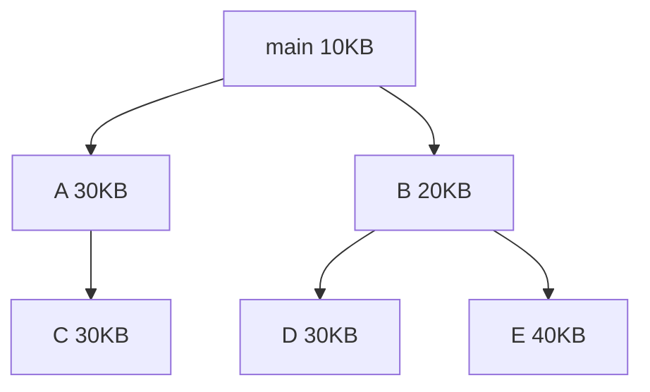

### 
**操作系統3-內存管理(虛擬內存)**

#### 5.虛擬存儲器

5.1 **局部性原理**

早在1968年P.Dening就指出：程序在執行過程中呈現出局部性規律。即在很短的時間內，程序的執行儘限於某個部分，其訪問的內存也僅限於某個區域。

局限性體現在時間和空間上，時間上程序中某條指令一旦執行，不就又可能再被執行。空間上某個存儲單元被訪問，不就又可能再被訪問。

5.2 **對換**

1. **對換的引入**

   在多道程序環境下，可能出現內存中的某些進程由於等待某時間而進入阻塞狀態，其佔用了大量內存。同時外存中等待的許多作業由於得不到足夠的內存而無法進入運行狀態。為了解決這一問題，引入了“對換”技術。

   而“對換”，即是把內存中不能運行的進程或暫時不用的程序或數據，調出內存，以騰出足夠的內存空間，再調入以具備運行條件的進程或進程所需要的程序或數據。

   如果對換是以進程為整個單位，則稱為“整體對換”或“進程對換”。通常應用與分時系統中以解決內存緊張的問題。如果對換是以“頁”或“段”為單位，則稱為“頁面對換”或“分段對換”，統稱為“部分對換”。

   **“部分對換”是實現請求分頁的和請求分段式存儲管理的基礎，其目的是為了支持虛擬存儲系統。**

   為了實現進程對換，必須實現三方面的功能：對換空間的管理，進程的換入和換入。

2. **對換空間的管理**

   在具有對換功能的OS中，通常把外存分為**文件區**和**對換區**。

   對於文件的存儲，主要目標是提高存儲空間的利用率，因此採用離散式存儲的方式。而進程在對換區駐留的時間比較短暫，對換的操作很頻繁，因此主要目標是提高訪問的速度，因此採用連續存儲的方式。

   **對於對換區的管理可以參考前面的內存管理的動態分區模式**。

3. **進程的換出換入**

   1. 進程的換出。每當一個進程由於創建子進程而需要更多的內存空間，**但又無足夠的內存空間時**，系統應將某進程換出。其過程是：**系統先選擇優先級最低的進程作為換出進程，然後啟動磁盤，將進程的程序和數據寫入對換區。若傳送過程未出現錯誤，則可回收該進程的內存空間，並修改該進程PCB的相關信息。**
   2. 進程的換入。系統定時查看所有進程的狀態。找出已處於“就緒”狀態但被換出的進程，將其中換出時間最久的進程作為換入進程。直到無可換入的進程或無可換出的進程為止。

5.3 **覆蓋**

在單用戶系統中，為了能夠在小內存中運行大作業，一些計算機採用了“覆蓋”技術，即將一個大程序按照程序的邏輯結構劃分成若干個程序段或數據段，將不會同時執行從而不必同時裝入內存的程序段分在一組內，該組稱為**覆蓋段**。這段話可能比較難以理解，舉例說明一下。

​	例4-2 ：有一個程序的程序結構如下圖，整個程序裝入需要160KB內存，但是圖中沒有箭頭相連的程序段都不會同時調用。如A和B不會同時在main內調用，所以當B程序段被調用時，A程序要麼已經運行完了，要麼要等待B先運行。所以A和B便可同時被分配到一段內存中，空間大小取兩段程序中較大的那個，即30KB。同理，C,D,E都可被分入一組。這樣下來，整段程序只需要10KB(main) + 30KB(A,B) + 40KB(C,D,E) = 80KB。從而節省了內存空間。

這種覆蓋管理技術採用的是靜態存儲分配和靜態重定位方式。如果在採用動態重定位的系統中運行，就不需要實現指定覆蓋區，在執行中調用模塊自然會決定裝入哪塊內存。

**覆蓋對於程序員並不透明**。為了實現好的覆蓋效果，程序員需要在編寫程序時精心安排好程序的覆蓋結構，並用覆蓋描述語言描述覆蓋和覆蓋段。

5.4 **虛擬存儲器**

前面講的都是將作業一次性裝入內存，但實際上一次性裝入內存是沒有必要的，會佔用大量的內存資源。由於程序運行的局限性，可以考慮一次只裝入部分的作業。

1. **虛擬存儲器的概念**

   裝入作業時，僅將當前要運行的部分裝入內存，當要執行的部分沒有裝入內存時，就從磁盤調入內存。當內存已滿時，則將內存中暫時不用的頁調出內存，釋放空間，再加載所需要的頁。這樣就顯得系統具有內存容量遠大於實際的內存容量，這樣的存儲器稱為虛擬存儲器。

   **虛擬存儲器即在作業運行時，僅將部分的程序和數據裝入內存就可以運行的虛擬存儲系統。具體來講，即指具有置換和請求調入功能，可以從邏輯上對內存進行擴充的一種存儲器系統。**

   虛擬存儲器除了要求有一定容量的主存和輔存之外，還要求有能夠進行快速地址變換的地址變換機構。

2. **虛擬存儲器的實現方法**

   虛擬存儲器的實現包括請求分頁系統和請求分段系統。

   1. 請求分頁系統。在分頁存儲的基礎上加入了請求分頁的功能和頁面置換的功能所形成的頁式虛擬存儲系統。請求調頁和頁面置換需要有頁表機構、缺頁中斷機制和地址變換機構的支持。
   2. 請求分段系統。與請求分頁系統極為類似。但是固定帶下頁面變成了按照邏輯結構分的段。