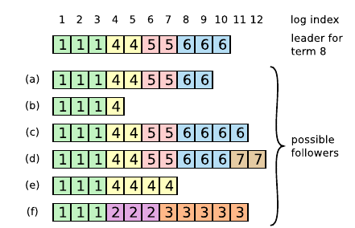

## Raft 一致性算法

所謂一致性算法，是指能夠允許一組機器可以協同工作並能容忍部分成員的宕機。在 Raft 算法出現之前，已經有 Paxos 算法朱玉在前，但是由於 Paxos 非常難以理解，因此斯坦福的兩位教授提出了 Raft 算法，Raft 算法被提出的首要目標是易理解性，正如其所言:

> It was important not just for the algorithm to work, but for it to be obvious why it works.

Raft 算法特點：

- 中央集权制：Raft 具有一個強有力的領袖节点
- 民主選举：使用隨機時間來選举領袖
- 成員变动：当需要变动集群中的服务器时，Raft 使用 *联合一致性* 算法来保证系统正常工作，从而是的系统在不宕机的前提下进行成员的更替。

### 复制状态机问题

分布式集群出现的前提是单个服务器的容错率已经不足以满足需求，因此需要部署服务器集群来提高容错率。将每个服务器看作一个状态机，一组状态机在初始状态相同，输入相同，转换函数和输出函数相同的前提下，输出必然是相同的。因此通过对比集群成员的输出，可以轻易地知道出错的服务器。

复制状态机由 *复制日志* 进行实现，每个日志项包含一系列有序的命令，每个状态机有序执行这些命令，在不出错误的情况下总能得到相同的结果。通常这些日志项由领袖服务器进行接收，并由其分发给其它的服务器。分发必须确保所有命令的数量和顺序完整性。分发完成后，由每个服务器执行并将结果返回给客户端。

### Raft 一致性算法

Raft 实现一致性首先通过选举出一个领袖节点，领袖节点负责从客户端接收命令并分发给其它所有服务器，并告知服务器可以安全执行这些命令的时间节点。

Raft 将一致性问题分为以下三个问题：

- 选举领袖：当现领袖节点无法响应时，必须选举新的领袖节点
- 复制日志：领袖节点必须接收客户端的日志项，并将其分发给所有集群里的所有成员
- 安全性：任何一个状态机执行了某一个日志项，则对于同一个日志索引，其它服务器不应该执行到任何不同的命令。即保证同一个日志索引对于任何服务器而言都是对应的同一个命令。

#### Raft 基础

通常对于一个具有 $2n+1$ 个服务器的 Raft 集群来说，其可允许的错误服务器数量为 $n$。

任意时刻单个服务器状态只可能处于 *领袖*、*追随者*、*候选领袖* 中的一种。在正常工作的情况下，则只有一个领袖节点和其它的追随者节点。

Raft 将系统时间划分为不同的 *任期*， 每个任期的长度不一且总以选举开始，如果任期内选举出领袖，则正常工作直至任期结束；如果任期内没有选举出领袖，则在新任期开始时重新选举。没有选举出领袖通常是指有多个候选领袖的票数相同。

不同服务器的任期变化并不是同时发生的，每个服务器携带有一个当前的任期号（线性增加），但是这个任期号可能并不是全局的当前任期号，所以当服务器与其他服务器通信时，如果发现对方的任期号大于己方，则修改任期号为对方任期号。如果有领袖节点或候选领袖节点发现自己的任期号小于其他服务器的任期号，则立刻转换为追随者状态。而其它服务器接收到小于自己任期号的服务器的请求时，则会直接拒绝。即领袖服务器的任期号必须大于等于其追随者的任期号才合法。

Raft 通过 RPC (Remote Procedure Call) 与其他服务器进行通信，Raft 只包含两种类型 RPC：

- RequestVote RPC: 请求选票
- AppendEntries RPC：添加日志项，领袖节点发送心跳信息也是这类RPC, 但是不携带日志项（用于向其他服务器表明领袖节点没有失联）

#### 选举领袖

正常情况下，领袖节点定期向其追随者发送心跳信息，如果存在追随者在一定时间内没有接收到心跳信息，则其认为领袖已经失联，随即发起一轮新的选举。

当该追随者发起一轮新的选举时，其将自己的任期号加一，用于表示进入新的任期，自身状态进入候选领袖状态。随后向集群的所有服务器平行发送 RequestVote RPC，该候选者将持续该状态直到下列情况中的一种发生：

1. 赢下选举：条件是赢下大多数服务器的选票，而追随者投票的规则是只会投给不小于自己的任期号的候选者，且根据先到先得的规则只能投一票；当某个服务器赢得选举之后，其会给其它所有服务器发送心跳消息来建立自己的权威以及组织新的选举进行。
2. 已有另一个服务器赢下选举：在当前服务器等待选票的过程中，可能会接收到 AppendEntries RPC（来自于领袖节点），如果该RPC 的任期号至少大于等于当前服务器的任期号，则说明已有合法领袖，当前服务器退回追随者状态；如果任期号小于当前服务器，则说明是过时的领袖，则拒绝请求并保持候选状态。
3. 一段时间之后依旧没有胜者：当多个候选者同时竞选时，可能存在没有任何一个候选者获得大多数选票，则无法产生一个合法的领袖，需要进行新一轮的选举，在没有外界干预的情况下，可能一直无法产生领袖。

Raft 使用 *随机化选举时长* 来尽可能减少第三种情况的出现，随机时长通常出现在150-300ms 之间，因此更容易出现一个服务器可以先出现超时从而成为领袖节点（在多个候选节点的情况下）。

#### 复制日志

领袖节点负责从客户端接收命令并组成日志项并并行分发给其它服务器，如果其它节点由于运行速度、网络问题或者已经崩溃，领袖节点依旧会持续给这些服务器发送 AppendEntries RPC 直到所有节点都已经存储所有日志项。

每个日志项不仅所要执行的命令，同时携带其被组成时的领袖节点任期号以及一个索引号用于表征该日志项在所有日志中的位置。

当一个日志项已经被安全复制到大多数服务器上时，其可被认为是 *已提交 (committed)* 状态。同时也代表领袖节点之前的所有日志项也已经是已提交状态（包括之前的领袖节点所创建的日志项），即日志项的提交是有序的。

而领袖节点负责记录当前已被提交的日志项的最大索引，并将该索引携带于 AppendEntries RPC 中，对于追随者节点，小于等于该索引的日志项可安全按顺序执行。

Raft 维持以下属性来确保安全性：

- 如果两个位于不同服务器日志中的日志项具有相同的索引和任期号，则其必然包含相同的命令；
- 同上条件的两个日志项，则其两个日志在这两个日志项之前的所有日志项也必然相同。

在正常情况下，领袖节点可以与其追随者节点保持一致；但是当领袖节点突然宕机时，该领袖节点可能并没有将其日志安全复制到所有节点，因此可能导致新上任的领袖无法与其他节点保持一致，包括以下情况：

- 服务器缺失日志项，即没有完全复制所有日志项；
- 存在比当前领袖服务器的最大任期号更大的任期号的日志项，即当前领袖节点没有被前领袖完全复制日志项；
- 存在比当前领袖服务器的最大任期号更小但不存在于当前的领袖服务器的日志中的日志项。这种情况发生的原因是该服务器曾为领袖服务器，但是生成这些日志项后未来得及提交就已经宕机，导致这些日志项只存在于该服务器内。

为了保持领袖节点与追随者节点的同步，领袖节点必须找到与追随者节点最近的前部分相同的节点，然后将追随者节点之后的所有日志项删除并复制领袖节点的之后的日志项。所有这些动作由追随者节点在对 AppendEntries RPC 的回复中完成。