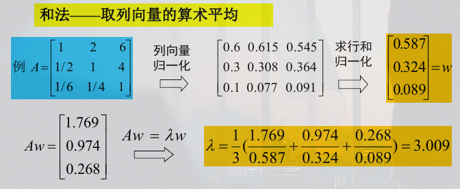

### 层次分析法

层次分析法(Analytic Hierarchy Process, AHP)是一种定性和定量结合的系统的、层次化的分析方法。

层次分析法的步骤：

1. 建立层次结构模型；
2. 构造判断矩阵；
3. 层次单排序及一次性检验；
4. 层次总排序及其一次性检验；

#### 建立层次结构模型

一般层次结构分为三层：
- 目标层
最终的选用方案

- 准则层
决策每个方案需要考虑的因素

- 方案层
所有的备选方案

#### 构造判断矩阵

不同的判断准则之间总有优劣之分。例如建造一栋大楼，安全性准则的重要性肯定比美观性准则的要高。

而判断矩阵就是将所有准则与其它准则相对比并进行打分而得到的矩阵。

#### 层次单排序及其一致性检验

判断矩阵对应于最大特征值$\lambda_{\max}$的特征向量W，经归一化后即为同一层次相应因素对于上一层次某因素相对重要性的排序权值。这一过程称为层次单排序。

判断矩阵A中的元素应当满足：
$$
a_{ij}a_{jk} = a_{ik}, i,j,k=1,2,\dots,n
$$

称满足上述关系式的正互反矩阵为一致矩阵。

一致矩阵的最大特征值$\lambda_{\max} = n$，其余特征值为0
还有一致矩阵的秩为1

**定理**: n阶正互反矩阵A的最大特征根$\lambda\ge n$,当且仅当$\lambda=n$时，为一致矩阵。

对于正互反矩阵，若$\lambda_{\max}$比n大得越多，A的非一致性程度也就越严重。因此需要进行一致性检验

1. 计算一致性指标CI
$$
CI = \frac{\lambda_{\max} - n}{n-1}
$$
2. 查找相应的平均随机一致性指标RI
3. 计算一致性比例CR
$$
CR = \frac{CI}{RI}
$$
当CR < 0.10时，认为判断矩阵的一致性是可以接受的，否则应当对判断矩阵作适当修改。

#### 正互反矩阵的最大特征根和特征向量的简化计算

简化计算的思路：一致矩阵的任一列向量都是特征向量，一致性尚好的正互反矩阵的列向量都应近似特征向量，可取其某种意义下的平均。

**和法——取列向量的算术平均**

直接给出一个示例便可明白

#### 层次总排序及其一致性检验

根据层次单排序所得到的所有指标的权重$b_j$，对于每个备选方案$A_i$的每个指标都有一个值$w_{ij}$。

则计算

$$
w_i = \sum_{j=1}^{m}b_j*w_{ij}
$$

进行层次总排序的一致性检验：
$$
CR = \frac{a_1CI_1 + a_2CI_2 + \dots + a_mCI_m}{a_1RI_1 + a_2RI_2 + \dots + a_,mRI_m}
$$

当CR<0.1时，认为层次总排序通过一致性检验。层次总排序具有满意的一致性，否则需要重新调整那些一致性比率高的判断矩阵的元素取值。
