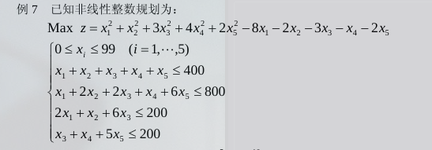

## 整数规划

### 分枝定界法

### 0-1型整数规划

### 蒙特卡罗法(随机取样法)

重点讲一下这个蒙特卡罗法



对于这样的题，如果使用完全的穷举法，则需要计算10^10^次。

其实如果使用蒙特卡罗法随机计算10^6^次，便可以找到满意解。

直接给MATLAB代码

首先编写一个函数，根据一组解计算目标函数的值和约束条件。
```matlab
function [f,g] = mente(x);
%f is the target function
%g is the constraints
f = x(1)^2 + x(2)^2 + 3*x(3)^2 + 4*x(4)^2 + 2*x(5)^2 - 8*x(1) - 2*x(2) - 3*x(3) - x(4) - 2*x(5);
g = [x(1) + x(2) + x(3) + x(4) + x(5) - 400 
x(1) + 2*x(2) + 2*x(3) + x(4) + 6*x(5) - 800 
2*x(1) + x(2) + 6*x(3) - 200 
x(3) + x(4) + 5*x(5) - 200
];
```

主函数
```matlab
rand('state', sum(clock));
res = 0;
tic
for i = 1:10^6
    x = 99*rand(5,1);
    x1 = floor(x);
    x2 = ceil(x);
    [f,g] = mente(x1);
    if sum(g <= 0) == 4
        if res < f
            res = f;
            x0 = x1;
        end
    end
    [f,g] = mente(x2);
    if sum(g <= 0) == 4
        if res < f
            res = f;
            x0 = x2;
        end
    end
end
x0,res
toc
```


