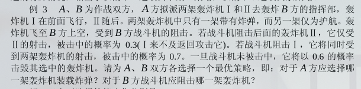

### 零和博弈

通常零和博弈的得损需要根据博弈双方的策略来决定，可能一方选取了最有利于自己的策略，但是对方选取策略后反而变成了不利于自己的策略。

比如对于如下策略矩阵
$$
A = \begin{bmatrix}
12&-6&30&-22\\
14&2&18&10&\\
-6&0&-10&16
\end{bmatrix}
$$

矩阵中的值$a_{ij}$表示己方选取了策略i，对方选取了策略j后己方的盈利。负值表示亏损。

选哪一行是己方决定的，所以己方就选定一行后对方肯定会选择自己盈利最小的那一列（因为是零和博弈，所以就等于是对方盈利最大的一列）。所以己方需要选择行最小值最大的那一行。

即
$$
a_{i^*j^*} = \max_{i}\min_{j}a_{ij} = \min_j\max_ia_{ij}
$$

这样的局势称为博弈的一个稳定点或者说定解。

#### 定理

记$\mu = \max_i\min_ja_{ij}, \nu = \min_j\max_ia_{ij}$

零和博弈G具有稳定解的充要条件是$\mu + \nu = 0$

#### 零和博弈的混合策略

具有稳定解的零和博弈是最简单的一类博弈，任一局中人都不可能通过自己的努力来改变最终结果。然而，在实际中遇到的零和博弈更多的是$\mu+\nu\ne0$的情况，这时需要使用零和博弈的混合策略。

设局中人I选取策略$\alpha_i$的概率为$x_i$，局中人II选取策略$\beta_j$的概率为$y_j$。

若存在m维(m为局中人I的可选策略数量)概率向量$\overline x$和n维(局中人II的可选策略数量)概率向量$\overline y$，使得对于一切m维概率向量x和n维概率向量y有
$$
\overline x^TA\overline y = \max_xx^TA\overline y = \min_y\overline x^TAy
$$

#### 例题

#### 零和博弈的线性规划解法

局中人I选择混合策略$\overline x$的目的是使得
$$
\overline x^TA\overline y = \max_x\min_yx^TAy = \max_x\min_yx^TA(\sum_{j=1}^ny_je_j)\\
= \max_x\min_y\sum_{j=1}^nE_jy_j
$$

其中$e_j$为只有第j个分量为1，其它分量为0的单位向量。$E_j = x^TAe_j$

记$u = E_k = \min_jE_j$,由于$\sum_{j=1}^ny_j=1$, $\min\sum_{j=1}^nE_jy_j$在$y_k=1,y_j=0(j\ne k)$时达到最小值u，故$\overline x$应为线性规划问题
$$
\max u\\
s.t. \begin{cases}
\sum_{i=1}^ma_{ij}x_i \le u,\quad j = 1,2,\dots,n(即E_j\le E_k)\\
\sum_{i=1}^m x_i = 1\\
\x_i \le 0, i = 1,2,\dots,m\\
$$

#### 例题

